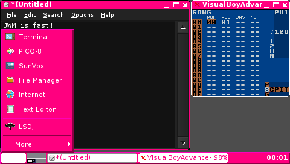

# pocketchip-jwmrc

[JWM](https://joewing.net/projects/jwm/) is a very nice window manager that can be used as a lighter replacement 
for the standard window manager on Pocket CHIP. 

The standard window manager is also nice, especially in the beginning, but it is a bit slow to start and it eats the CPUeven while being in the background (around 3%, but this is enough to cause some emulators to stutter). It's also a bit hard to customize.

In this repo you can find a config I use with JWM. 

## Features 

All the standard Pocket CHIP + Shutdown/Reboot options are available.

Missing/TODO:

- Battery indicator (should make a simple Xlib app to be swallowed into the tray).
- Easy access to audio settings (should add a couple of menu items calling alsamixer).
- Access to backlight settings (can have several items in the menu).
- Access to easy WiFi config.

## Installation

1. Install JWM:

	sudo apt-get install jwm

2. Install this config:

	wget https://raw.githubusercontent.com/aleh/pocketchip-jwmrc/master/.jwmrc -O ~/.jwmrc 

3. Replace your .dmrc so JWM starts by default:

	wget https://raw.githubusercontent.com/aleh/pocketchip-jwmrc/master/.dmrc -O ~/.dmrc

3. Reboot.

Enjoy!

